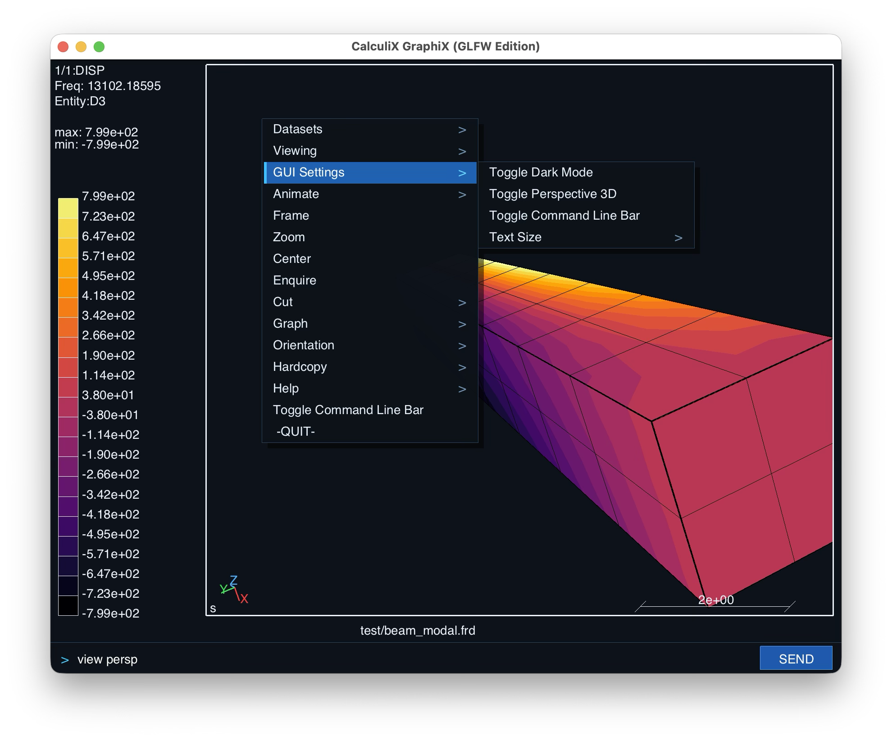

# CalculiX GraphiX (GLFW Edition)

> **A Modernized multi-platform edition of CalculiX GraphiX.**

[](COPYING)
[-brightgreen.svg)](#build-instructions)
[](#highlights--new-features)
[](#highlights--new-features)
[](#native-paraview-vtupvd-exporter)



---

## About This Project

This project is an **academic exercise for learning agentic programming** by **Carlo Monjaraz-Tec**, based on the great work of the original authors and contributors of **CalculiX GraphiX (CGX)**, originally led by **Klaus Wittig**.

The objective is to explore agent-assisted refactoring by modernizing CGX's windowing and rendering layer (introducing GLFW3, smooth vector typography via `stb_truetype`, an in-window command bar, dark mode, and 3D perspective projection) and VTU export, while keeping all core finite element mechanics, meshing routines (`libSNL`), file parsers, and solver workflows completely intact.

---

## Highlights & New Features

* **100% GLUT-Free & X11-Free**: Free of legacy X11, GLX, and raw GLUT dependencies. Windowing and input events are routed through a modern, native **GLFW3** layer across macOS (Apple Silicon / Intel), Linux (Wayland / X11), and Windows.
* **Anti-Aliased Vector Typography**: Integrated [`stb_truetype`](https://github.com/nothings/stb) single-header font engine. All  text renders with **smooth, crisp vector typography**.
* **Signature Dark Mode by Default**: Dark slate aesthetic with high-contrast foreground rendering.
* **True 3D Perspective Projection**: New implemented Perspective view for 3D Visualization.
* **Interactive In-Window Command Bar**: New field for commands, with command history navigation (`Up` / `Down` arrows), instant execution, and visual prompt.
* **Modern Cascading Context Menus**: Updated cascade menus.
* **Native Base64 Binary VTU/PVD Exporter**: 1-click export of complex 1D, 2D, and 3D meshes and transient results to ParaView (`send all vtu all`).

---

## Build Instructions

> **Platform Status**: Currently developed and tested on macOS. Linux and Windows builds are implemented in the cross-platform GLFW layer and testing is coming soon.

### macOS

1. **Install GLFW**:
   ```bash
   brew install glfw
   ```

2. **Clone & Compile**:
   ```bash
   git clone https://github.com/carlomontec/CalculiX-GraphiX-GLFW.git
   cd CalculiX-GraphiX-GLFW/cgx_2.23/src
   make -f Makefile.glfw -j$(sysctl -n hw.ncpu)
   ```

3. **Launch**:
   ```bash
   ../../bin/cgx_glfw
   ```

---

### Linux (Ubuntu, Debian, Fedora, Arch, openSUSE)

1. **Install Prerequisites**:
   * **Ubuntu / Debian / Linux Mint**:
     ```bash
     sudo apt-get update && sudo apt-get install -y build-essential libglfw3-dev libgl1-mesa-dev libglu1-mesa-dev
     ```
   * **Fedora / RHEL / Rocky**:
     ```bash
     sudo dnf install -y gcc-c++ glfw-devel mesa-libGL-devel mesa-libGLU-devel
     ```
   * **Arch Linux / Manjaro**:
     ```bash
     sudo pacman -S --needed base-devel glfw-x11 mesa glu
     ```

2. **Clone & Compile**:
   ```bash
   git clone https://github.com/carlomontec/CalculiX-GraphiX-GLFW.git
   cd CalculiX-GraphiX-GLFW/cgx_2.23/src
   make -f Makefile.glfw -j$(nproc)
   ```

3. **Launch**:
   ```bash
   ../../bin/cgx_glfw
   ```

---

### Windows (MSYS2 / MinGW-w64)

1. **Install Prerequisites in MSYS2 UCRT64 / MINGW64 Terminal**:
   ```bash
   pacman -S --needed base-devel mingw-w64-x86_64-gcc mingw-w64-x86_64-glfw
   ```

2. **Clone & Compile**:
   ```bash
   git clone https://github.com/carlomontec/CalculiX-GraphiX-GLFW.git
   cd CalculiX-GraphiX-GLFW/cgx_2.23/src
   make -f Makefile.glfw -j$(nproc)
   ```

3. **Launch**:
   ```bash
   ../../bin/cgx_glfw.exe
   ```

---

## Controls & Mouse Gestures

| Gesture | Action |
| :--- | :--- |
| **Left Click + Drag** | **Rotate 3D Model** (smooth trackball rotation around model center) |
| **Right Click + Drag** | **Pan / Translate** model horizontally & vertically |
| **Scroll Wheel** or **Middle Drag** | **Smooth Continuous Zoom** (unbounded zoom range) |
| **Right Click** (click & release) | **Open Multi-Level Cascading Menu** |

---

## Popular Commands (Type in Bottom Bar)

| Command | Action |
| :--- | :--- |
| `frame` | Auto-fit and center the 3D model in the viewport |
| `view persp` | Switch to realistic 3D Perspective Projection |
| `view ortho` | Switch to classic Orthographic parallel view |
| `view dark` | Switch viewport to modern Dark Mode (`#0D121A`) |
| `view light` | Switch viewport to classic Light Mode (White) |
| `ds <step> e <comp>` | Load and display specific result dataset (e.g. `ds 4 e 4`) |
| `plot fv all` | Plot filled contour values on entire model |
| `plot f all` | Plot filled surfaces |
| `plot e all` | Plot element wireframe mesh |
| `cmap <palette>` | Change colormap (`coolwarm`, `turbo`, `viridis`, `inferno`, `jet`, `classic`) |
| `anim real` | Start real-time modal or transient animation |
| `send all vtu all` | Export entire model and all time-steps to ParaView `.vtu` & `.pvd` |

---

## Native ParaView VTU/PVD Exporter

Export your CalculiX models directly to ParaView with full result fields:

```text
send <set> vtu [all] [ascii]
```

* **Default Base64 Binary Encoding**: Ultra-compact and fast to load.
* **1-Click Time-History Playback**: Running `send all vtu all` creates individual time-step `.vtu` files and automatically links them into a master ParaView Collection file (`.pvd`).
* **Full Element Support**: Converts TET4, TET10, HEX8, HEX20, WEDGE6, WEDGE15, PYR5, PYR13, TR3, TR6, QUAD4, QUAD8, BEAM2, BEAM3 to canonical VTK cells.

---

## License & Attribution

This project is free and open-source software distributed under the **GNU General Public License Version 2 (GPL-2.0 or later)**, strictly adhering to the original CalculiX licensing.

### Original Authors & Copyright:
* **CalculiX GraphiX (CGX)** is created and copyrighted by **Klaus Wittig** (`klaus.h.wittig@t-online.de`).
* **CalculiX CrunchiX (CCX)** is created and copyrighted by **Dr. Guido Dhondt** (`dhondt@t-online.de`).
* Official CalculiX website: [http://www.calculix.de](http://www.calculix.de) / [https://www.dhondt.de](https://www.dhondt.de)

### Project Maintainer & AI Pairing:
* Modernized by **Carlo Monjaraz-Tec** ([@carlomontec](https://github.com/carlomontec)) in collaboration with **Antigravity (AGY)** as an open-source academic exploration of agent-assisted scientific software modernization.
* **Disclaimer**: This software is provided "AS IS", without warranty of any kind, express or implied. The authors assume no liability for errors, bugs, or damages.
